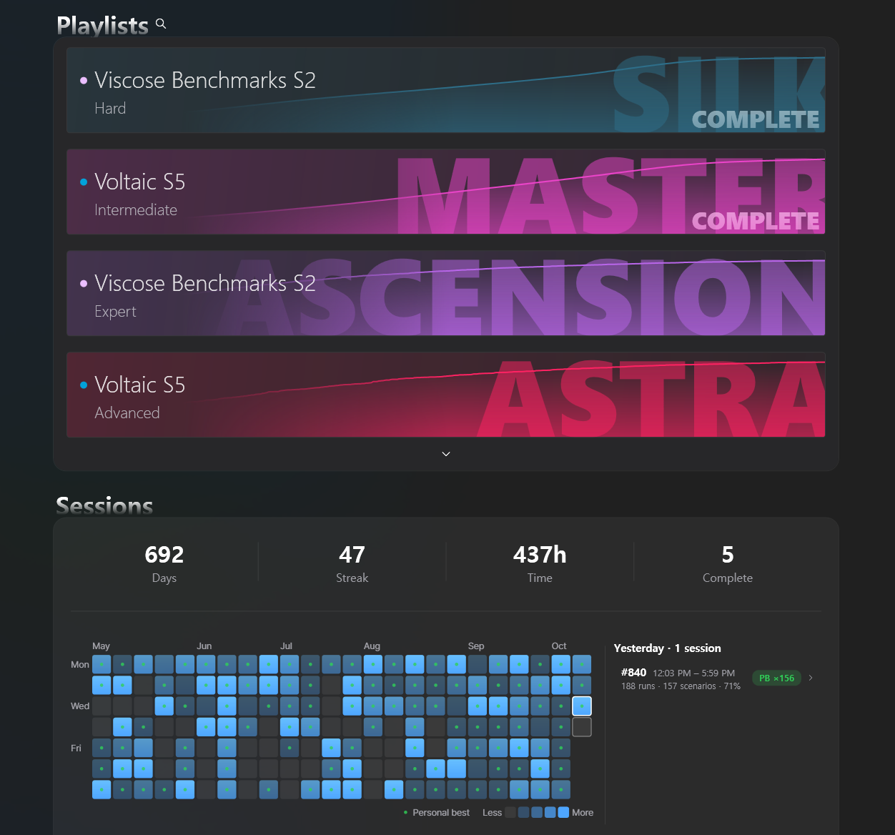

# KovaaksCompanion

Windows companion app for KovaaK's. It tracks your benchmark progress and records every run so you can watch it back with your crosshair path drawn on top.



## Features

- **Stats page:** benchmark playlists with per-scenario scores, tiers and progress, favorites, a pinned current-tier view, an activity calendar and recent sessions. Local history comes from the game's `* Stats.csv` files; benchmark progress and leaderboard ranks come from your KovaaK's account.
- **Run recording:** while the game is running, only the game window (and only its audio) is captured into a rolling buffer. When a run ends, the clip around it is saved without re-encoding. Optional hand cam overlay; clips still encoding show a progress ring.
- **Profile page:** favorite benchmarks as tier cards next to your overall stats, exportable as a PNG image (saved in the `captures` folder under the data folder).
- **Replay:** playback with speed, scrubbing and frame step, plus the mouse trajectory (recorded via Raw Input) over the video and a chart of accuracy and other run stats under it. A manual sync nudge corrects drift.
- **Tray app:** starts minimized, one instance, optional start with Windows, update check from GitHub Releases.

## Requirements

- Windows 10 2004 or newer, x64.
- KovaaK's installed through Steam. The app finds the install and the stats folder on its own.
- For video: a GPU with a hardware H.264 encoder (NVIDIA NVENC, AMD AMF or Intel Quick Sync). There is no software encoding; without a supported GPU the stats features still work and recording stays off.
- Recommended (estimate, not benchmarked): CPU i3-12100F / Ryzen 5 3600, GPU GTX 750 Ti / Radeon RX 560 or better, with current graphics drivers.

## Install

Download the exe from [Releases](https://github.com/dededed1024/KovaaksCompanion/releases) and run it. No installer. Data is stored under `%LOCALAPPDATA%\KovaaksCompanion` unless you change the location in Settings.

## Build

```
dotnet build KovaaksCompanion.slnx -c Release
```

The build downloads a pinned, hash-checked FFmpeg (`scripts/fetch-ffmpeg.ps1`) and embeds it in the exe.

## Notices

Unofficial; not affiliated with or endorsed by KovaaK Games. "KovaaK's" and its branding belong to KovaaK Games. Benchmark playlist definitions come from [evxl.app](https://evxl.app) by EviL. Video uses an unmodified FFmpeg LGPL v3 build; see [THIRD-PARTY-NOTICES.md](THIRD-PARTY-NOTICES.md) for sources and licenses.

The app's own code is MIT licensed ([LICENSE](LICENSE)).
